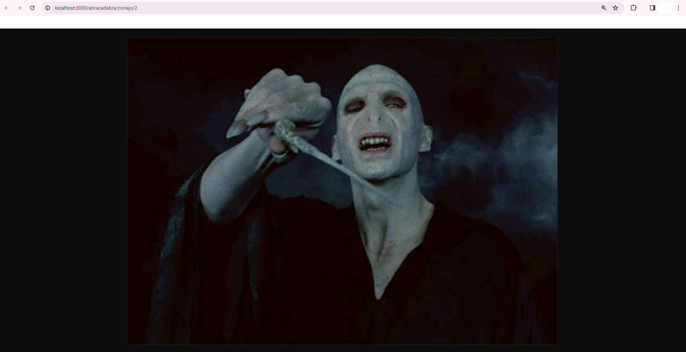
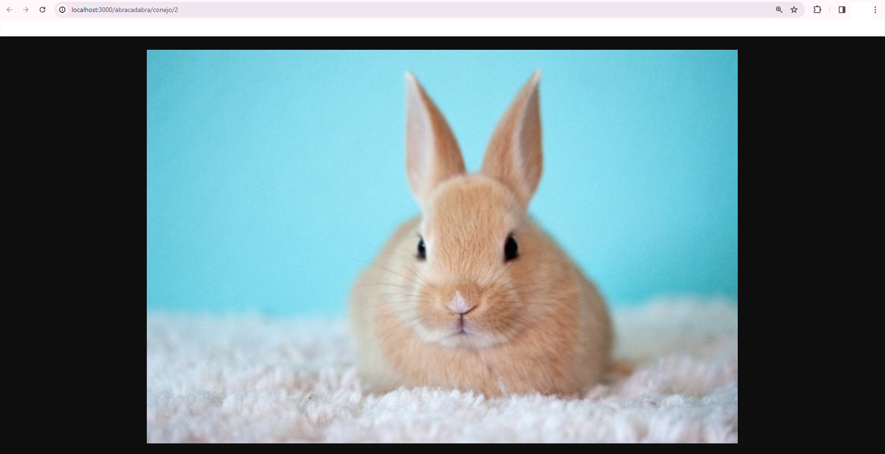

Desafío Abracadabra
Desafío de magia, 4 sombreros solo 1 tiene el conejito.

Descripción
HTML con Node, página con 4 sombreros los cuales de manera aleatoria entre 1 y 4, devuelve un Voldemort para la elección que no coincida o un conejito si coincide.

Visuales
Página de inicio

No coincidencia

Coincidencia

Autores
Katherine Medina https://github.com/Lucyxnira/
